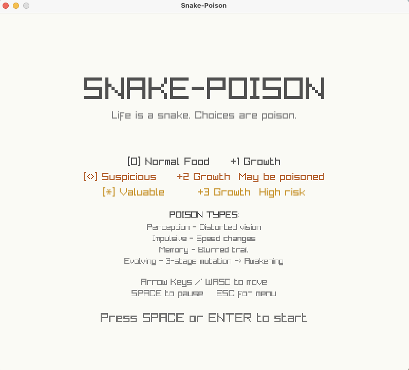
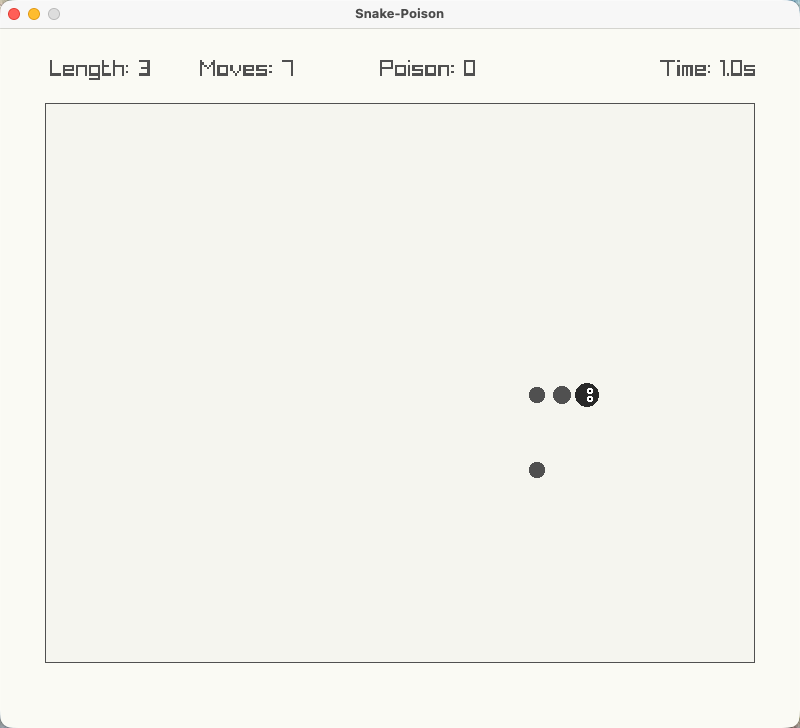
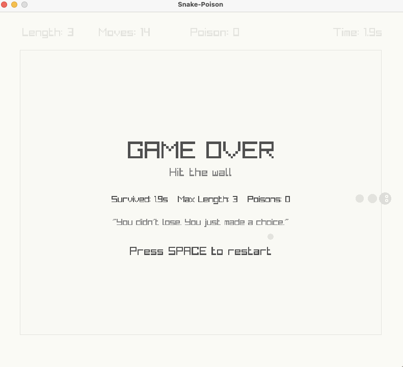

# 🐍 Snake-Poison

> **"Life is a snake. Choices are poison. Evolution is inevitable."**

A philosophical twist on the classic snake game featuring a poison system, visual effects, and procedural audio.


## 🎮 Features

### Poison System
Not all food is safe. Some carry poison that affects gameplay:

| Type | Effect | Risk/Reward |
|------|--------|-------------|
| **Perception** | Distorted vision, flickering food | See hidden items |
| **Impulsive** | Unpredictable speed changes | Faster movement |
| **Memory** | Blurred snake trail | Reset negative states |
| **Evolving** | 3-stage mutation | Unlock abilities |

### Awakening Abilities
Survive the Evolving poison's 3 stages to unlock:
- **TrueSight** - See through illusions
- **Dash** - Burst of speed
- **Rebirth** - Second chance
- **Phase** - Pass through yourself

### Visual Effects
- Screen shake on collision/poison
- Particle effects for eating, death, awakening
- Dynamic background based on poison state
- Smooth snake rendering with eyes

### Procedural Audio
All sounds are generated programmatically:
- Pop sound for eating
- Buzz for poison
- Thud for death
- Rising ding for evolution

## 🚀 Quick Start

### Download (No .NET Required)
Download the latest release for your platform from [Releases](https://github.com/TsekaLuk/Snake-Poison/releases):
- **macOS (Apple Silicon)**: `SnakePoison-macOS-arm64.zip`
- **macOS (Intel)**: `SnakePoison-macOS-x64.zip`
- **Windows**: `SnakePoison-Windows-x64.zip`

Unzip and run the executable directly.

### Build from Source

**Prerequisites**: [.NET 8.0+](https://dotnet.microsoft.com/download)

```bash
# Clone the repository
git clone https://github.com/TsekaLuk/Snake-Poison.git
cd Snake-Poison

# Run the macOS/Desktop version (Raylib)
dotnet run --project MacApp

# Or run the Console version
dotnet run --project ConsoleApp
```

## 🎹 Controls

| Key | Action |
|-----|--------|
| ↑↓←→ / WASD | Move |
| Space | Pause / Start |
| ESC | Menu |
| Enter | Start / Restart |

## 📁 Project Structure

```
Snake-Poison/
├── MacApp/                 # Raylib desktop version (recommended)
│   ├── Program.cs          # Main game with graphics & audio
│   └── SnakePoison.Mac.csproj
├── ConsoleApp/             # Terminal-based version
│   ├── Program.cs
│   └── SnakePoison.Console.csproj
└── Assets/Scripts/         # Unity version (DDD architecture)
    ├── Domain/             # Core entities (Snake, Poison, World)
    ├── Application/        # Game logic & events
    ├── Infrastructure/     # Persistence & AI
    └── Presentation/       # Input handling
```

## 🛠️ Tech Stack

- **Game Framework**: [Raylib](https://www.raylib.com/) via [Raylib-cs](https://github.com/ChrisDill/Raylib-cs)
- **Language**: C# 11 / .NET 8+
- **Audio**: Procedurally generated WAV
- **Architecture**: Domain-Driven Design (Unity version)

## 🎨 Design Philosophy

Inspired by:
- **Notion** - Minimalist UI aesthetic
- **Musk's First Principles** - Simplify to the core
- **NCE4 "Eat the snake or be eaten"** - Choice as the central theme

The game explores:
- Risk vs Reward decisions
- Growth through adversity
- The beauty of simple mechanics with deep consequences

## 📸 Screenshots

| Menu | Gameplay | Game Over |
|:----:|:--------:|:---------:|
|  |  |  |

## 📄 License

MIT License - See [LICENSE](LICENSE) for details.

## 🤝 Contributing

Contributions welcome! Feel free to:
- Report bugs
- Suggest new poison types
- Add visual themes
- Improve audio

---

**"You didn't lose. You just made a choice."**
